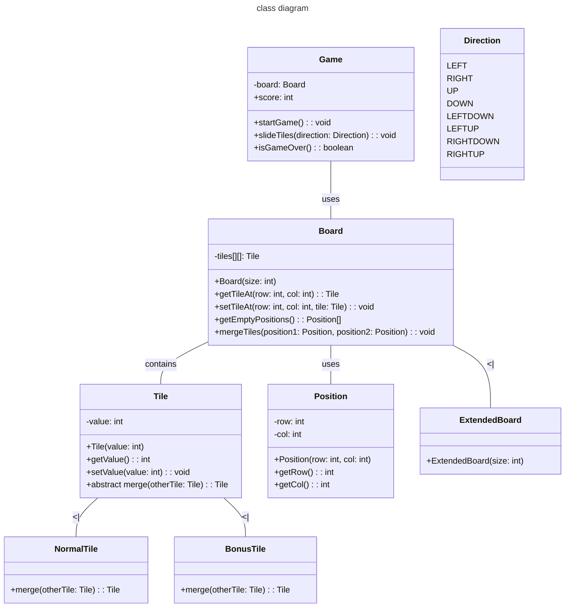
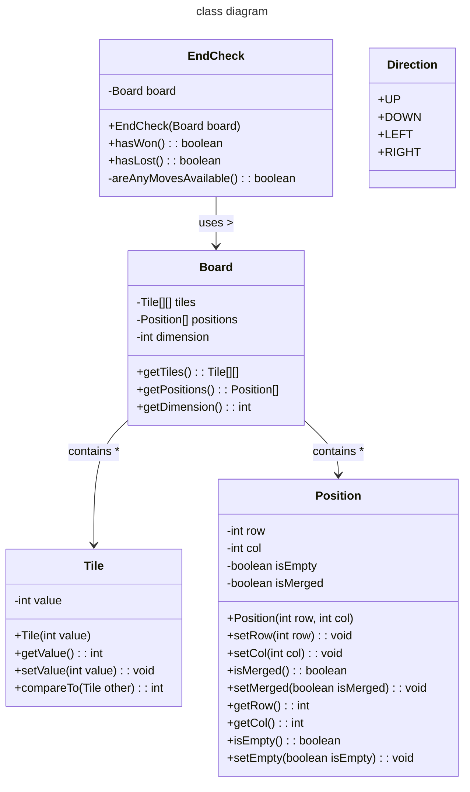

[](https://classroom.github.com/online_ide?assignment_repo_id=11516026&assignment_repo_type=AssignmentRepo)
# Final Project 📖📚✍️✅💯🎓

Objectives:

In this project you will:

* Demonstrate your mastery of OOD to solve a challenging problem
* Design a solution with MVC architecture with JavaFX
* Apply all (or most) of the programming concepts used in this course
* Use design patterns to raise cohesion and lower coupling as well as to avoid re-inventing the wheel
* Meet objectives of prior assignments

## On Groups

This project can be completed individually or with a group of up to three (3) people. If the latter, the work done must be worthy of the additional personnel i.e. if one student could have completed this by themselves then the final grade will be halved (or by two-thirds).

## Part 1: The Idea

Think of three (3) real problems that excite you. Consider for example:

* a problem that you're encountering at work
* an issue that you run into daily in your usual routine
* a CS problem that sparks your curiosity
* a challenge from when you were an undergraduate
* a new unique game you want to develope

This project is a culmination of all of you've learned in this class including Object-Oriented Design, Testing, UML, Design Patterns, and most importantly is a showcase for MVC requiring JavaFX.

Should you want to do some data visualization (like with NumPy or Pandas in Python) a widely used tool for Java is [JFreeChart](https://www.jfree.org/jfreechart/samples.html). This tool is not a replacement for JavaFX but can be used to create images that can be loaded into JavaFX.

If you're working with a team - each member should come up with three (3) unique ideas.

Share your ideas on a private Piazza post, visible to the Instructors and the other members of your team, *by the date listed in Canvas*. We will discuss with you the feasiblity and difficulty of implementing each idea, raising the bar if the problem is too simple, or lowering it if too complicated. If an idea you selected already has many examples online, like on StackOverflow, we will veto it. Finally, we'll recommend to the group which idea would make for the best project. If you dislike any requirements that we add, your group can suggest new ideas until all parties are satisfied.

You cannot proceed to Part 2 until Part 1 is approved.

## Part 2: The Design

This is where you will design a UML Class Diagram that your team will submit here on this README.md written in Mermaid. Use every tool to ensure that the system that you design follows proper OOD principles, is well organized, appears highly cohesive, and lously coupled. Your use of Design Patterns needs to be indicated with UML Notes as part of the diagram.


The second half of this part is a mock-up of what you want your application to look like using [SceneBuilder](https://gluonhq.com/products/scene-builder/). Add these .fxml files to the repo and include screenshots of your renderings below.

// your screenshots here

No actual Java code will be written for this part. Submit everything by the date identified on Canvas. The teaching teach will provide rapid feedback on your diagram and Views. You can move on to Part 3, just be aware that you may need to change things if the Teaching Team finds issues.

## Part 3: Implementation

A failure to plan is a plan to fail -- but you've done all of the planning, now is the time to build it 😎

There is also a codewalk where you will meet with the Instructors to go over your mostly completed application and get feedback all aspects, including design, Views, missing components, etc., that will need to be addressed before submitting a final result.

## Documentation and Testing

Your project needs to follow the Google style format and reach 70% code coverage from your testing on components not related to the View/Control. You are expected to show a screenshot from your JaCoCo coverage report below, identifying the level of code coverage.

```markdown
Image Rendering Syntax:


Example:

```

// add your screenshot here

## UML & Design Patterns

// add final UML Class Diagram written in Mermaid here. This is the new version of the UML but leave the old version in the earlier section.



Also fill in the table below explaining the design patterns that you used in your application.

| Pattern Name | Class(es) | Justification |
| :--------: | ------- | :------- |
| ExamplePattern1 | `Listing`, `Agent` | This pattern allowed for a seperation of duties between the different types of `Property` so that the `Agent` could list multiple types of `Property` without needing to be concerned with the type or writting special code inside of `Listing` following the guidance of encapsulating tasks. |
| Pattern2 Composite Pattern| `Board`, `Tile`, `Position` | The Composite Pattern allows you to compose objects into tree structures to represent part-whole hierarchies.Here, Board acts as the composite, containing multiple Tile objects. Each Tile has a Position. The entire board can be thought of as a tree with the Board at the root and the Tile objects as the leaves.|
| Pattern3 Strategy Pattern| `Game`, `Board` | The Strategy Pattern defines a family of algorithms, encapsulates each one, and makes them interchangeable.In our case, Game is the context, and Board (or its future variants) encapsulates the strategy to manage game state. |
| Pattern4 State Pattern| `Game`, `Direction` | The State Pattern allows an object to alter its behavior when its internal state changes.For the 2048 game, the Game class can alter its behavior (i.e., the direction in which tiles slide) based on the current direction state (Direction). |
| Pattern5  Factory Method Pattern| `Board`, `Tile` | The Factory Method Pattern defines an interface for creating an object, but allows subclasses to alter the type of objects that will be created.In our design, Board could serve as the creator with a factory method to produce Tile objects, allowing for creating different types of tiles based on game conditions. |

## Reflection

Each member of your group needs to provide an answer to *each* question and be sure to clearly identify whose response is whose.

1. Describe one lesson from this course and how it impacted this project.

   Weicheng: One of the significant lessons from this course was the importance of code modularization and documentation.

   Yuan: One lesson I learn from this course is that objective-oriented design is essential for doing project specifically in Java.


2. What part of this assignment did you find the most challenging and why?

   Weicheng: The most challenging part of the assignment was handling edge cases for the game logic. While the primary game rules were straightforward to implement, ensuring that every possible user action resulted in the expected behavior required a deeper understanding of the logic and multiple rounds of testing.

    Yuan: I spent a lot of time working on debugging `Controller` and I found out that the logics of codes are very important. Most of our mistakes are using methods or classes in wrong sequences or wrong places.

3. Assume that you are doing this project over again, what element(s) would you change and how?

   Weicheng: If I were to redo this project, I would invest more time in the initial planning and design phase. While our approach was adequate, some time was wasted due to revisiting and revising components of the game we had already built.

   Yuan: I would definitely think about the design pattern which we didn't really focues on in the design stage of our project. This wasted us a lot of time and caused many bugs.

4. How did the process of this assignment, specifically completing Part 2 before starting Part 3, impact your learning?

   Weicheng: Completing Part 2 before Part 3 was instrumental in understanding the core mechanics of the application. By establishing the foundational elements in Part 2, we were more prepared to handle the advanced features and challenges presented in Part 3. It was a lesson in the importance of having a solid foundation before expanding or adding complexity to a project.

    Yuan: The thinking process of Part2 gave me a blueprint of what our project would look like in advance of actually working on it. It also visualized what each classes did or even what each functions did in my head. This helped me a lot in the following coding stage.

5. Think back on what you knew before starting this course and what you know now. What advice would you tell your younger self having completed this project?

    Weicheng: Before starting this course, I had a basic understanding of programming concepts but didn't appreciate the intricacies of software design and development fully. I'd emphasize the importance of collaboration and seeking feedback. Working with others not only brings in diverse perspectives but also fosters innovative solutions to problems.

    Yuan : I would tell my younger self to value the communication and network with others, especially your teammate. A good collaboration is built on a good interaction between people and people.

## Accountability
In this section, identify who worked on what parts.

Weicheng: 2048 Game, Testing, UML

Yuan: `Board`, `Controller`, JavaFx Implementation
